# Rate My Teacher Project Report

## 1. Project Overview

Rate My Teacher is a PHP/MySQL web application where students can:

- Register using an institutional `@kmcen.edu.np` email.
- Log in securely.
- Search teachers by name and course.
- View teacher ratings and written reviews.
- Filter a teacher's ratings by subject.
- Submit ratings for a teacher and subject.
- Mark reviews as helpful.
- Report inappropriate or inaccurate reviews.

The application uses server-rendered PHP pages, MySQL through MySQLi prepared statements, Bootstrap, Font Awesome, Bootstrap Icons, and custom CSS.

## 2. Technology Stack

| Layer | Technology |
|---|---|
| Frontend | HTML5, CSS3, Bootstrap 5.3.3 |
| Icons | Font Awesome, Bootstrap Icons, inline SVG |
| Fonts | Inter and Manrope |
| Backend | PHP |
| Database | MySQL |
| Database API | MySQLi |
| Authentication | PHP sessions |
| Password security | `password_hash()` and `password_verify()` |
| Request style | Server-rendered GET and POST forms |
| Validation | HTML validation and PHP server-side validation |

## 3. Directory Structure

```text
RateMyProfessor/
├── database.sql
├── index.php
├── config/
│   └── dbconn.php
├── css/
│   ├── login.css
│   ├── rating.css
│   ├── register.css
│   ├── style.css
│   └── teacher-profile.css
├── images/
├── includes/
│   ├── auth.php
│   ├── footer.php
│   ├── navbar.php
│   ├── rating_submission.php
│   ├── review_actions.php
│   └── search_backend.php
├── js/
│   └── script.js
├── pages/
│   ├── login.php
│   ├── logout.php
│   ├── rating.php
│   ├── ratings.php
│   ├── register.php
│   ├── search.php
│   └── teacher-profile.php
└── graphify-out/
```

## 4. Main Concepts

### Teacher

A teacher is stored in the `teachers` table. Each teacher has a numeric identifier, a display name, and one or more assigned subjects.

### Student

A student is a registered user with an institutional email, course, enrollment year, and hashed password. After login, the student's identity is stored in a PHP session.

### Subject

A subject represents an academic subject. It contains a subject name, course, and semester.

### Rating

A rating belongs to one student, one teacher, and one subject. It contains quality and difficulty scores, a take-again answer, written feedback, date, and status.

### Approved Review

Only ratings with `status = 'Approved'` are included in public search results, teacher statistics, and review listings.

### Helpful Vote

A logged-in student can mark an approved review as helpful. Clicking again removes the vote.

### Review Report

A logged-in student can report a review with a reason. A unique database constraint prevents the same student from repeatedly reporting the same review.

### Overall Scope

Teacher profiles support two rating scopes:

- `Overall`: all approved ratings for the teacher.
- A selected subject: only approved ratings for that teacher and subject.

The selected scope affects the average quality, difficulty, take-again percentage, total review count, rating breakdown, and review list.

## 5. Database Schema

### `students`

Stores registered students.

| Column | Description |
|---|---|
| `s_id` | Auto-increment primary key |
| `s_course` | Student's course |
| `enrollment_year` | Student's enrollment year |
| `s_email` | Unique institutional email |
| `password_hash` | Hashed password |

The schema requires the email to end with `@kmcen.edu.np`.

### `teachers`

Stores teachers.

| Column | Description |
|---|---|
| `t_id` | Primary key |
| `t_name` | Teacher name |

### `subjects`

Stores academic subjects.

| Column | Description |
|---|---|
| `subject_id` | Primary key |
| `subject_name` | Subject title |
| `course` | Course such as BCA or BBA |
| `semester` | Semester number stored as text |

### `teacher_subjects`

Associates teachers with subjects. This is a many-to-many relationship between `teachers` and `subjects`.

| Column | Description |
|---|---|
| `t_id` | Foreign key to `teachers` |
| `subject_id` | Foreign key to `subjects` |

The composite primary key prevents duplicate assignments.

### `admin`

Stores administrator accounts.

| Column | Description |
|---|---|
| `admin_id` | Primary key |
| `username` | Admin username |
| `password` | Admin password |

The schema includes administrators, but the current application does not yet provide an admin login or moderation dashboard.

### `ratings`

Stores student reviews and numerical ratings.

| Column | Description |
|---|---|
| `r_id` | Primary key |
| `quality_rating` | Quality score from 1 to 5 |
| `difficulty_rating` | Difficulty score from 1 to 5 |
| `take_again` | `yes` or `no` |
| `review` | Written review text |
| `review_date` | Submission date |
| `status` | Review status such as `Pending` or `Approved` |
| `semester` | Semester associated with the subject |
| `s_id` | Student foreign key |
| `t_id` | Teacher foreign key |
| `subject_id` | Subject foreign key |
| `admin_id` | Optional administrator foreign key |

### `rating_helpful_votes`

Stores helpful votes.

| Column | Description |
|---|---|
| `r_id` | Review foreign key |
| `s_id` | Student foreign key |
| `created_at` | Vote creation timestamp |

The composite primary key `(r_id, s_id)` prevents duplicate votes.

### `rating_reports`

Stores reports submitted against reviews.

| Column | Description |
|---|---|
| `report_id` | Primary key |
| `r_id` | Review foreign key |
| `s_id` | Reporting student |
| `reason` | Report explanation |
| `status` | Report status |
| `created_at` | Creation timestamp |

The unique key `(r_id, s_id)` prevents duplicate reports by the same student.

## 6. Entity Relationship Diagram

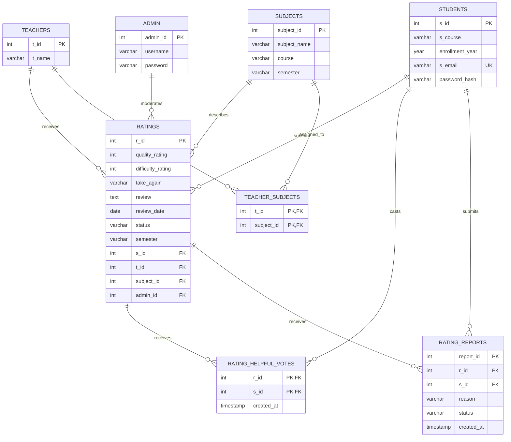

## 7. File Responsibilities

### `index.php`

The homepage. It includes the shared navbar and footer, displays the hero section, provides the global teacher search form, shows popular course links, explains the platform, and links users to teacher browsing.

### `config/dbconn.php`

Creates the MySQLi database connection in `$conn`. It defines the database host, username, password, and database name, and stops execution if the connection fails.

### `includes/auth.php`

Provides authentication helpers. It starts sessions, defines the required email domain, validates KMC email addresses, retrieves the current student email, and clears invalid sessions.

Main functions:

```php
isKmcenEmail(string $email): bool
currentStudentEmail(mysqli $conn): ?string
```

### `includes/navbar.php`

Shared navigation component. It displays the brand, Browse, Top Lists, and About links. It also displays the logged-in student's email and logout link, or login and register links when logged out.

### `includes/footer.php`

Shared footer with platform, legal, support, and contact links.

### `includes/search_backend.php`

Search query and aggregation layer. It reads and validates search parameters, joins teachers with approved ratings, calculates statistics, filters results, sorts results, and handles pagination.

Supported filters:

- Teacher name.
- Course.
- Minimum rating.

Supported sorting:

- Highest rated.
- Lowest rated.
- Most reviewed.
- Name.

### `includes/rating_submission.php`

Contains `submitRating()`, the rating write service. It requires a logged-in student, validates ratings, validates the review length, confirms the subject belongs to the teacher and student's course, confirms semester eligibility, and inserts the rating.

### `includes/review_actions.php`

Contains `handleReviewAction()`. It validates authentication and CSRF tokens, confirms the review belongs to the teacher and is approved, toggles helpful votes, and inserts or updates reports.

### `pages/register.php`

Student registration page. It validates the institutional email, course, enrollment year, and password, hashes the password, creates the student record, starts a session, and redirects to search.

Client-side features include browser validation, password visibility, password strength feedback, a terms checkbox, and a back button.

### `pages/login.php`

Student login page. It validates the institutional email, loads the student, verifies the password hash, regenerates the session ID, stores the student identity, and redirects to search.

### `pages/logout.php`

Clears session variables, deletes the session cookie, destroys the session, and redirects to the homepage.

### `pages/search.php`

Teacher search and browsing page. It displays search, course filters, minimum-rating filters, teacher result cards, calculated statistics, sorting controls, and pagination.

Each teacher card links to:

```text
teacher-profile.php?t_id=<teacher id>
```

### `pages/teacher-profile.php`

Main teacher profile page. It validates the teacher ID, loads teacher information and available subjects, calculates overall or subject-specific metrics, displays approved reviews, provides sorting and pagination, and supports helpful votes and review reports.

The profile scope works as follows:

```text
No subject_id:
    Use all approved ratings for the teacher.

With subject_id:
    Use approved ratings for the selected teacher and subject.
```

### `pages/rating.php`

Rating submission page. It loads the teacher, loads the logged-in student, calculates academic semester eligibility, displays available subjects, collects quality and difficulty scores, collects the take-again answer, collects written feedback, and calls `submitRating()`.

### `pages/ratings.php`

Compatibility redirect that sends users to the rating page when a valid teacher ID is provided, or to search when it is not.

### `js/script.js`

Currently empty. Most page-specific JavaScript is embedded directly inside the relevant PHP pages.

## 8. Main Data Flows

### Registration Flow

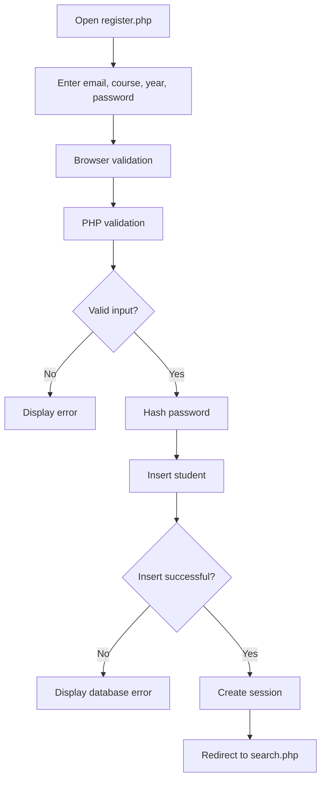

### Login Flow

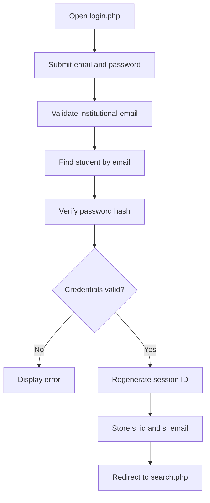

### Search Flow

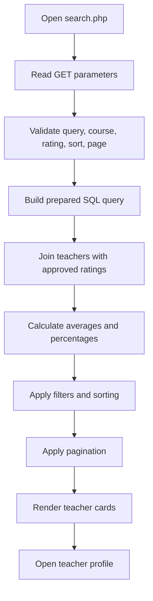

### Rating Submission Flow

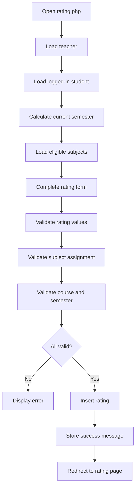

### Teacher Profile Flow

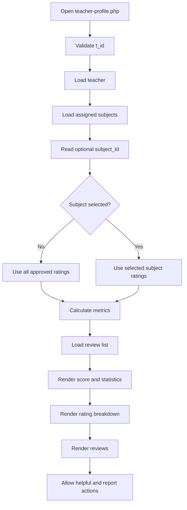

### Helpful Vote Flow

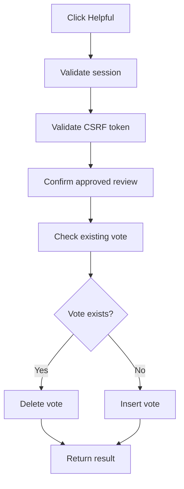

### Report Flow

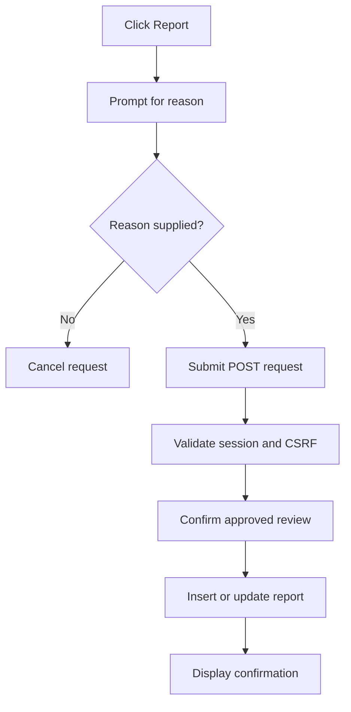

## 9. SQL Concepts Used

The project uses:

- Prepared statements.
- Parameter binding.
- `INNER JOIN`.
- `LEFT JOIN`.
- `EXISTS`.
- `AVG()`.
- `COUNT()`.
- `SUM()`.
- `COALESCE()`.
- `NULLIF()`.
- `GROUP BY`.
- `HAVING`.
- `ORDER BY`.
- `LIMIT`.
- `OFFSET`.
- `GROUP_CONCAT()`.
- `FIELD()`.
- `ON DUPLICATE KEY UPDATE`.
- Foreign keys.
- Composite primary keys.
- Unique constraints.

User-controlled values are passed through prepared statements. Sort expressions are selected from an allowlist before being placed into SQL.

## 10. Frontend Concepts

The frontend uses:

- Bootstrap responsive grid utilities.
- Shared navbar and footer components.
- Search forms and filter forms.
- Responsive teacher cards.
- Custom rating buttons.
- Subject scope tags.
- Rating breakdown progress bars.
- Review cards.
- Pagination.
- Password visibility controls.
- Password strength feedback.
- Client-side form validation.
- Inline SVG icons.
- Font Awesome icons.
- Bootstrap Icons.
- CSS custom properties.
- Responsive media queries.
- Hover and focus states.

The visual style uses blue brand colors, neutral gray text, soft tinted backgrounds, rounded cards, Inter for body text, and Manrope for headings and prominent controls.

## 11. Security Features

Implemented security measures include:

- Password hashing with `password_hash()`.
- Password verification with `password_verify()`.
- Session regeneration after login.
- Institutional email validation.
- Prepared SQL statements.
- Escaped HTML output using `htmlspecialchars()`.
- CSRF validation for review actions.
- Review ownership checks.
- Approved-review checks.
- Unique constraints against duplicate votes and reports.
- Server-side validation in addition to browser validation.

## 12. Current Security and Design Concerns

### Database credentials in source code

`config/dbconn.php` contains database credentials directly in PHP. Production deployments should use environment variables or a configuration file excluded from version control.

### Sample admin password

The SQL file inserts an administrator password in plain text. Administrator passwords should be hashed using `password_hash()`.

### Rating status behavior

`rating_submission.php` currently inserts new ratings with `status = 'Approved'`. This makes new ratings publicly visible immediately. If moderation is intended, new ratings should initially use `Pending`.

### Missing database range constraints

The database does not enforce quality and difficulty ranges or allowed values for `take_again` and `status`. PHP validates these values, but database constraints would provide additional protection.

### Incomplete admin features

The schema contains administrators, reports, and review status fields, but there is no admin dashboard for approving reviews, rejecting reviews, reviewing reports, managing teachers, or managing subjects.

### Course validation inconsistency

The registration interface presents a fixed list of courses, but server-side registration currently only checks that the course is non-empty. The server should enforce the same allowlist.

### CSRF coverage

Review actions use CSRF protection, but login, registration, and rating submission do not currently use CSRF tokens.

## 13. Recommended Future Improvements

1. Move database credentials to environment variables.
2. Add administrator authentication.
3. Add an administrator moderation dashboard.
4. Insert new reviews as `Pending` when moderation is required.
5. Add database `CHECK` constraints.
6. Add CSRF protection to registration and rating submission.
7. Add indexes for `ratings.t_id`, `ratings.subject_id`, `ratings.status`, and `ratings.review_date`.
8. Add server-side course allowlisting.
9. Add error handling when `mysqli_prepare()` fails.
10. Add automated tests for authentication, rating validation, subject ownership, search filtering, vote toggling, and report deduplication.
11. Remove unused or outdated CSS selectors.
12. Move repeated JavaScript into dedicated files.
13. Add a centralized URL helper.
14. Improve accessibility states for custom rating controls.
15. Add login and report rate limiting.
16. Add a migration system instead of relying only on one database initialization file.

## 14. Overall Architecture Summary

The project follows a lightweight procedural MVC-like structure:

```text
Browser Request
      |
      v
PHP Page Controller
      |
      v
Include or Service Layer
      |
      v
MySQL Database
      |
      v
Rendered HTML Response
```

Examples:

```text
search.php
  -> search_backend.php
  -> teachers, ratings, subjects
  -> teacher result cards
```

```text
rating.php
  -> rating_submission.php
  -> student, subject, course, semester validation
  -> ratings insert
```

```text
teacher-profile.php
  -> review_actions.php
  -> teacher statistics and reviews
  -> helpful votes and reports
```

The application is a functional teacher review platform with a clear relational schema, reusable PHP includes, server-side validation, and responsive frontend pages. Its main unfinished area is administrative moderation and production-grade security configuration.

## 15. Context Diagram

The context diagram treats Rate My Teacher as one system and shows its relationship with the external actors and data store. Students are the primary users. Administrators are included as a planned moderation actor because the database contains administrator, report, and review-status concepts, although an administrator interface is not currently implemented.

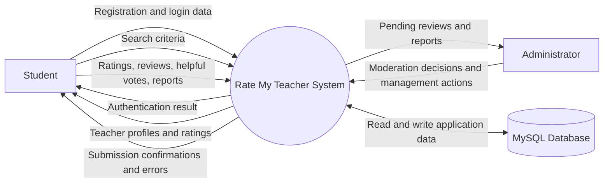

### Context Diagram Description

- The **Student** submits account data, search criteria, ratings, written reviews, helpful votes, and reports.
- The system returns authentication results, teacher listings, statistics, reviews, validation messages, and submission confirmations.
- The **Administrator** is intended to review reports and moderate ratings, but the current codebase does not yet contain the admin screens required for this interaction.
- The **MySQL database** stores students, teachers, subjects, ratings, votes, reports, and administrator records.

## 16. Level 1 Data Flow Diagram

The Level 1 DFD decomposes the system into its main business processes and data stores.

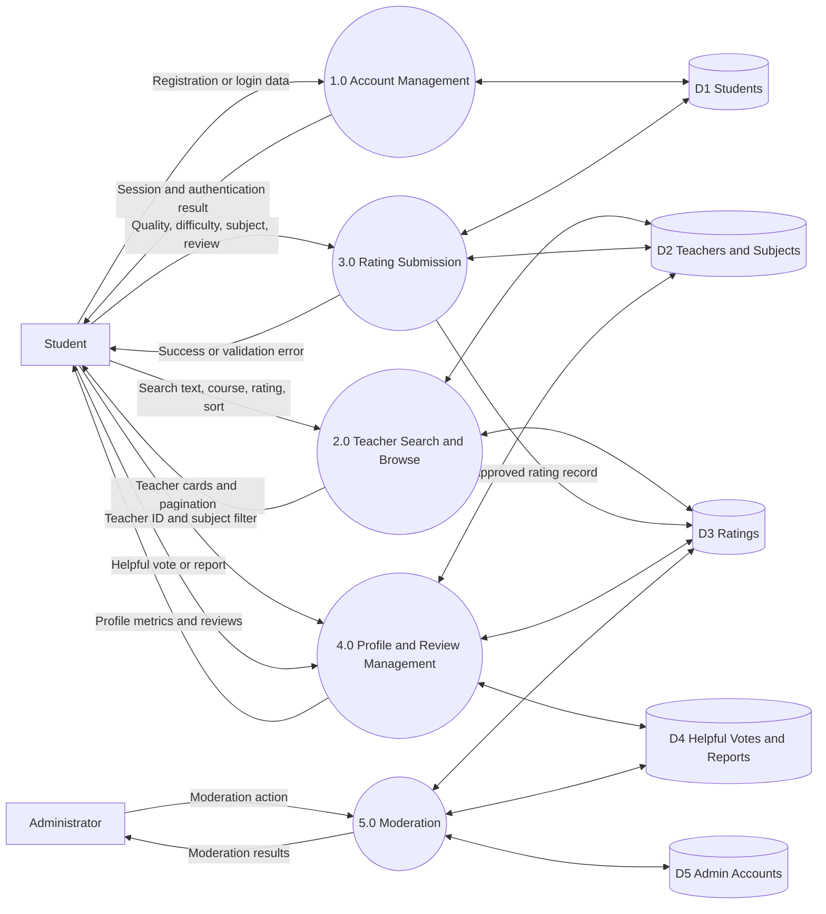

### Level 1 Process Descriptions

| Process | Responsibility |
|---|---|
| 1.0 Account Management | Validates institutional email, registers students, verifies passwords, and manages sessions. |
| 2.0 Teacher Search and Browse | Filters, sorts, aggregates, and paginates teacher results using approved ratings. |
| 3.0 Rating Submission | Validates rating values, subject ownership, course, semester eligibility, and saves reviews. |
| 4.0 Profile and Review Management | Displays profile statistics and reviews, applies subject filters, handles helpful votes and reports. |
| 5.0 Moderation | Planned process for approving, rejecting, and reviewing reports. |

## 17. Level 2 Data Flow Diagrams

### 17.1 Level 2 DFD: Account Management

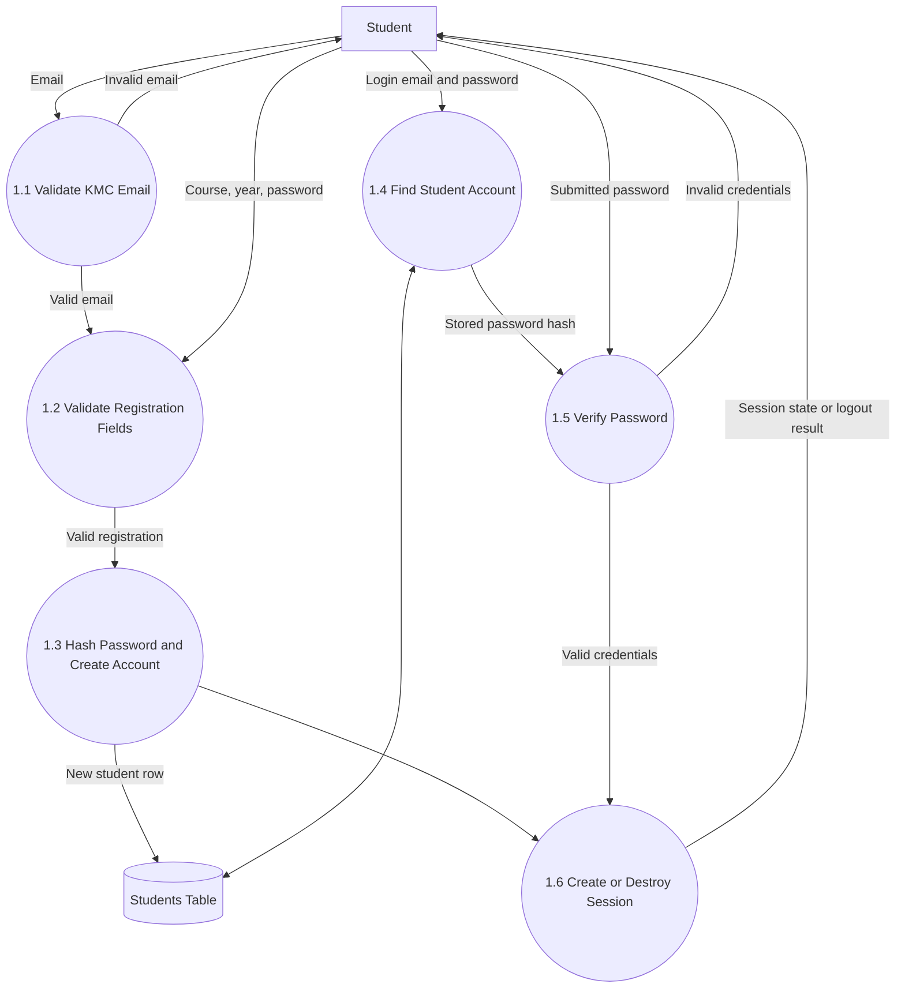

### 17.2 Level 2 DFD: Teacher Search

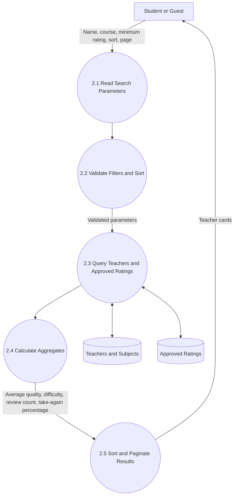

### 17.3 Level 2 DFD: Rating Submission

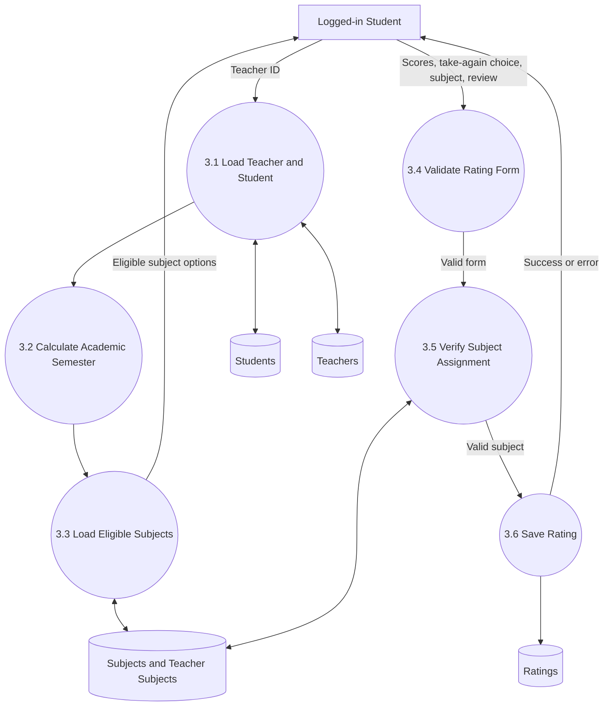

### 17.4 Level 2 DFD: Teacher Profile and Review Actions

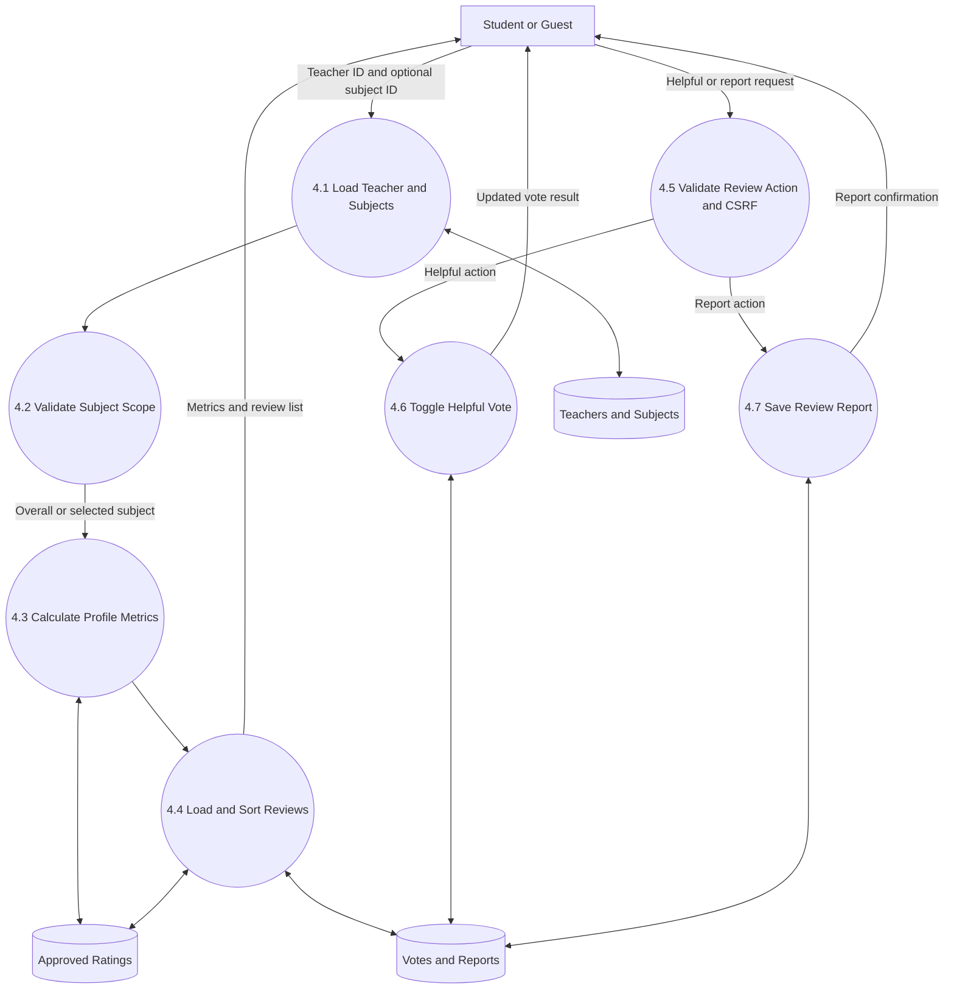

## 18. Definitive System Flowchart

This is the single end-to-end flowchart for the complete application. It combines the major user journeys into one definitive flow.

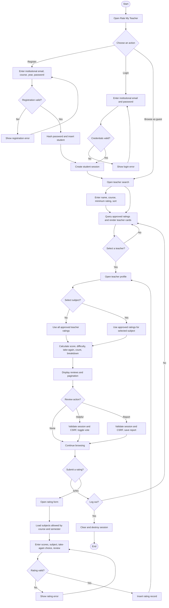

## 19. Use Case Diagram

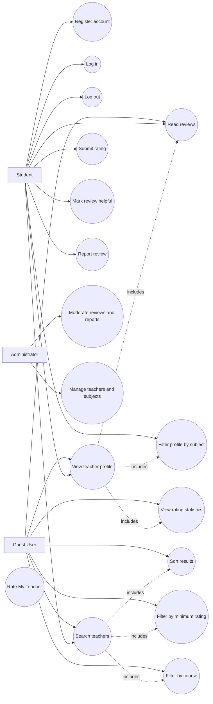

### Use Case Notes

| Actor | Main capabilities |
|---|---|
| Guest User | Search, filter, sort, view profiles, view statistics, and read approved reviews. |
| Student | All guest capabilities plus registration, login, logout, rating submission, helpful votes, and review reports. |
| Administrator | Planned moderation and teacher/subject management capabilities. |

## 20. Ten-Week Project Gantt Chart

The project plan follows the provided schedule. Requirements and feasibility work occupy the first two weeks. Design is completed before front-end development begins in Week 4. Back-end development begins in Week 5 and runs in parallel with front-end work. Testing occupies Weeks 8 and 9. Documentation runs continuously, with final report compilation and review buffered into Week 10.

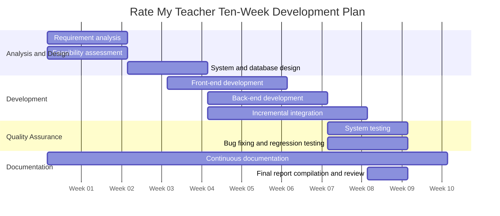

### Gantt Schedule by Week

| Week | Planned work |
|---|---|
| Week 1 | Requirement analysis, stakeholder needs, project scope, initial feasibility assessment, documentation. |
| Week 2 | Complete requirements, confirm feasibility, identify risks, finalize functional requirements, documentation. |
| Week 3 | System design, database design, interface planning, architecture decisions, documentation. |
| Week 4 | Front-end development begins after requirements and design are finalized. Continue documentation. |
| Week 5 | Back-end development begins. Front-end and back-end development proceed in parallel. Continue documentation. |
| Week 6 | Continue front-end and back-end implementation. Integrate registration, login, search, profiles, and rating workflows. Continue documentation. |
| Week 7 | Incremental integration, database verification, review actions, responsive UI refinement, preparation for testing. Continue documentation. |
| Week 8 | System testing begins. Test authentication, search, profile metrics, rating submission, review actions, and database behavior. Continue documentation. |
| Week 9 | Continue system testing, fix defects, perform regression testing, verify requirements, and stabilize the application. Continue documentation. |
| Week 10 | Final report compilation, diagram review, formatting, final verification, submission preparation, and short schedule buffer. |

### Schedule Dependencies

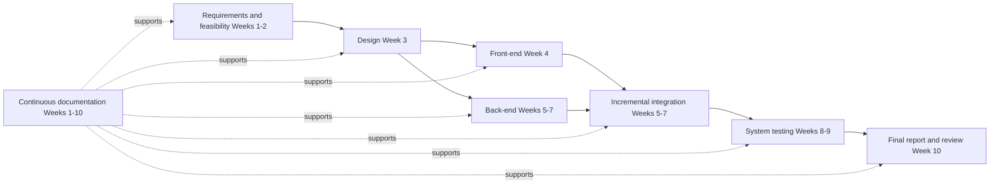

## 21. Diagram Interpretation Summary

- The **context diagram** shows the system boundary and external actors.
- The **Level 1 DFD** shows the major processes and data stores.
- The **Level 2 DFDs** expand account management, search, rating submission, and teacher profile actions into smaller processing steps.
- The **definitive flowchart** shows the complete user journey from opening the system through registration, browsing, rating, review actions, and logout.
- The **ER diagram** shows the database entities, keys, and relationships.
- The **use case diagram** shows what guests, students, and administrators can do.
- The **Gantt chart** maps the ten-week plan to analysis, design, development, testing, documentation, and final submission.
